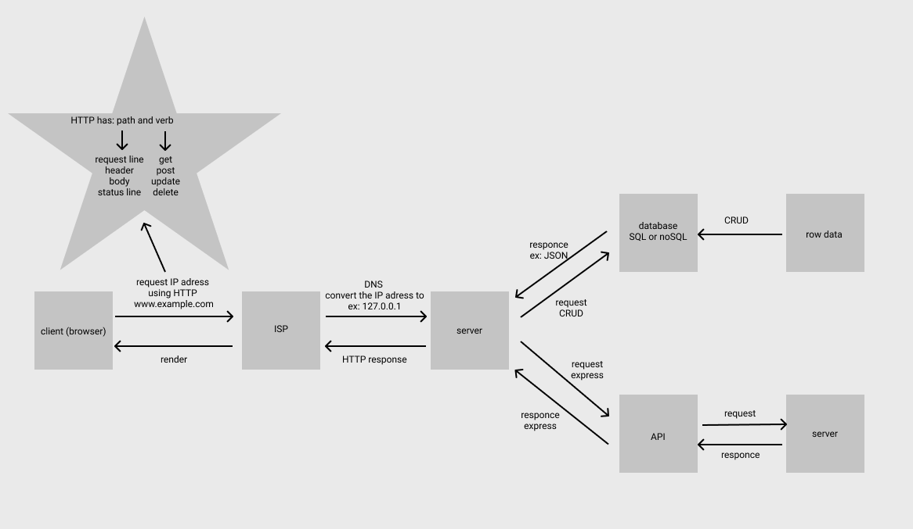

# Movies-Library - v01

## **Emad Almajdalawi**

 

 

## WRRC, API, DataBase

## Overview
This website shows a library of movies

## Getting Started
To start this app you must:
- Install the files to your device
- Install express, core, dotenv, axios, and pg packages by run the code   npm install express cors dotenv axios pg
- Start npm by run the code    npm start
- Open the browser then :
    1. For home page enter http://localhost:8080/ 
    2. For favorit page and http://localhost:8080/favorit
    3. For trending page enter http://localhost:8080/trending
    4. For search page enter http://localhost:8080/search
    5. For popular page enter http://localhost:8080/popular
    6. For tv page enter http://localhost:8080/tv
    7. For get movies page enter http://localhost:8080/getMovies
    8. For requests from database:
        - To add movie http://localhost:8080/addMovies
        - To get moive by id http://localhost:8080/getMovies/:id
        - To update by id http://localhost:8080/updateMovie/:id
        - To delte by id http://localhost:8080/deleteMovie/:id

## Project Features
This website offer a lists about movies, for exampl, trending and tv shows, also you can and movies to a favorate.
