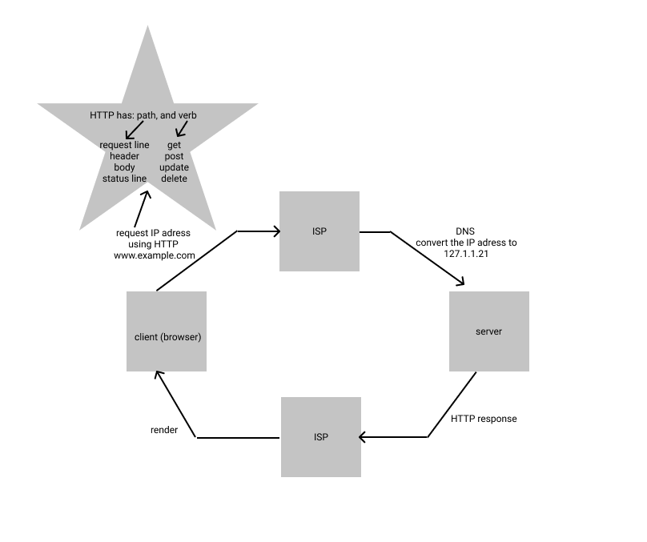

# Movies-Library - v01

## **Emad Almajdalawi**

 

 

## WRRC

## API

## Overview
This website shows a library of movies

## Getting Started
To start this app you must:
- Install the files to your device
- Install express, core, dotenv, and axios packages by run the code   npm install express cors dotenv axios
- Start npm by run the code    npm start
- Open the browser then :
1. For home page enter http://localhost:8080/ 
2. For favorit page and http://localhost:8080/favorit
3. For trending page enter http://localhost:8080/trending
4. For search page enter http://localhost:8080/search
5. For popular page enter http://localhost:8080/popular
6. For tv page enter http://localhost:8080/tv

## Project Features
This website offer a lists about movies, for exampl, trending and tv shows.
